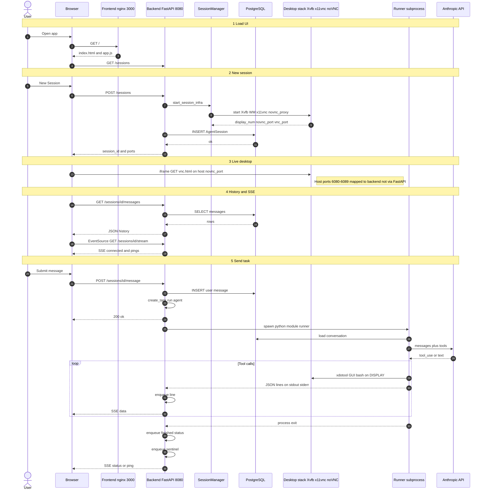

Author: Ahmed Sadaqat

# Setup
```bash
cd /home/dev/development/combioml-test

export ANTHROPIC_API_KEY="YOUR_KEY_HERE"

sudo docker compose down --remove-orphans
sudo docker compose up --build
```

```bash
# Frontend
http://localhost:3000

# Backend
http://localhost:8080

# noVNC (per session)
http://localhost:6080/vnc.html
```

